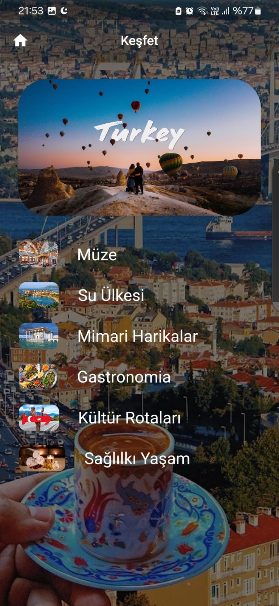
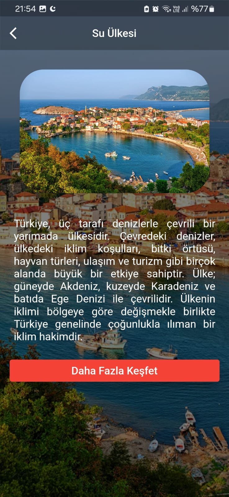
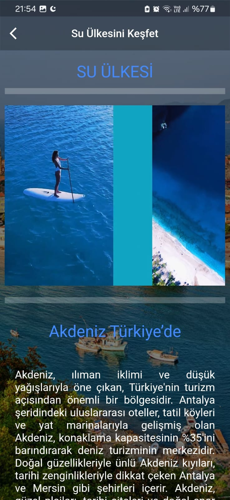
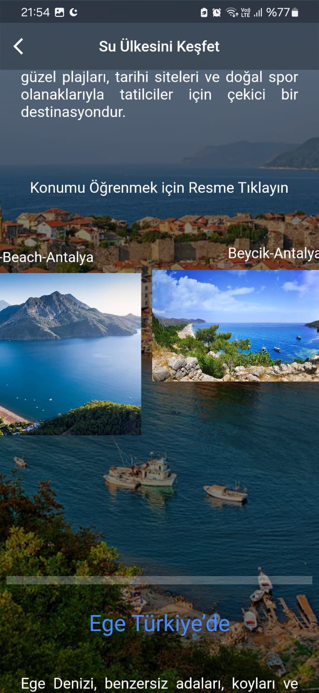
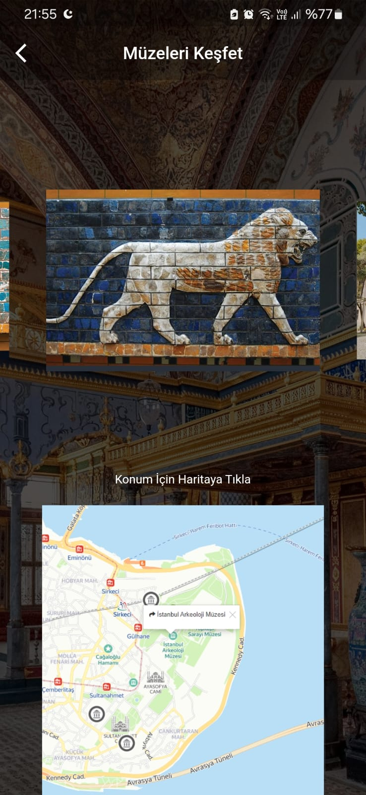
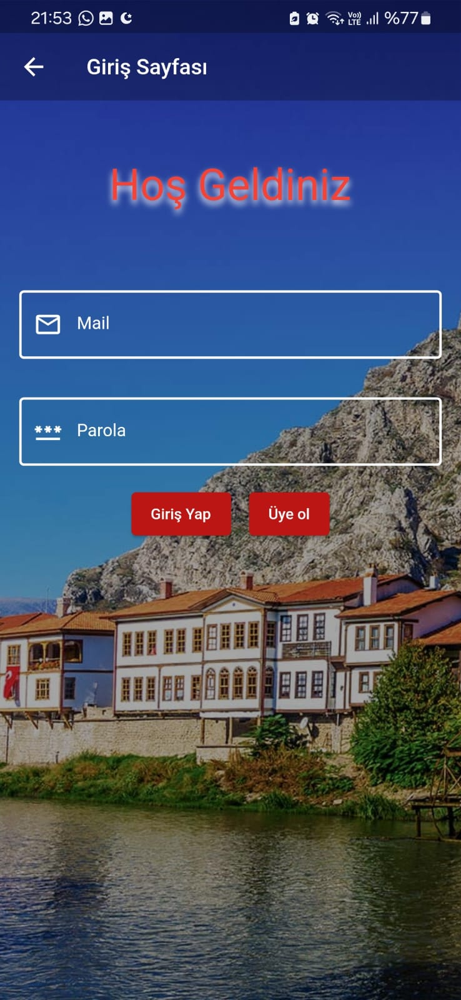
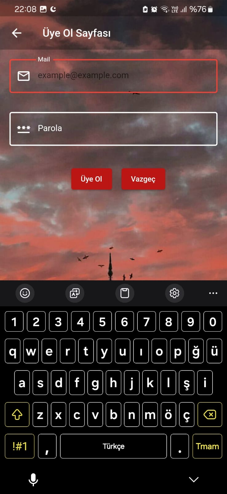

# 🇹🇷 Explore Turkiye - Flutter App

A Flutter application that showcases Turkey's most beautiful and culturally rich destinations.  
Explore historical landmarks, stunning nature, and modern cityscapes — all in one app!

---

## 📱 App Screenshots

<div align="center">
  
  
  
  
  
</div>

---

## 🔐 Authentication

<div align="center">
  
  
  
</div>

---

## 🚀 Features

- Browse and Explore Turkiye
- View detailed descriptions and images  
- Smooth user experience with Flutter  
- Authentication: Login / Sign Up pages  
- Simple and clean UI  

---

## 🛠️ Installation

```bash
git clone https://github.com/HarunEnsar/Explore_Turkiye_Android_App.git
cd Explore_Turkiye_Android_App
flutter pub get
flutter run
